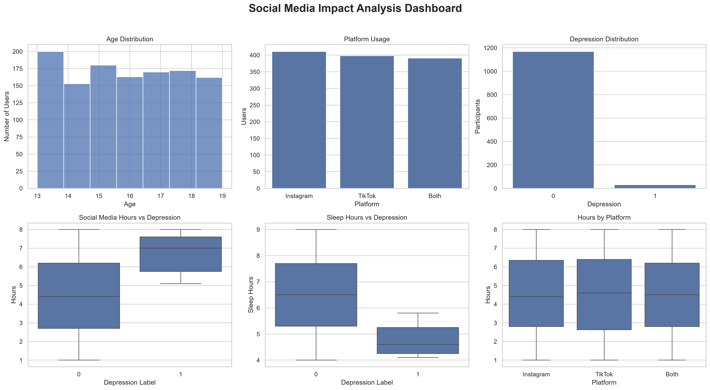

# 📊 Social Media Impact Analysis

## 📌 Project Overview

This project analyzes the impact of social media usage on teenagers' mental health using Python.

The analysis explores relationships between daily social media usage, sleep hours, stress, anxiety, addiction, and depression through Exploratory Data Analysis (EDA) and data visualization.

---

## 🎯 Objectives

- Analyze social media usage patterns.
- Explore factors related to depression.
- Identify relationships between behavioral variables.
- Build an analytical dashboard.

---

## 📂 Dataset

- Records: **1200**
- Features: **13**

Main Features:

- Age
- Gender
- Platform Usage
- Daily Social Media Hours
- Sleep Hours
- Screen Time Before Sleep
- Academic Performance
- Physical Activity
- Social Interaction Level
- Stress Level
- Anxiety Level
- Addiction Level
- Depression Label

---

## 🛠️ Technologies Used

- Python
- Pandas
- NumPy
- Matplotlib
- Seaborn
- Jupyter Notebook
- VS Code

---

## 📈 Dashboard



---

## 🔍 Key Insights

- Instagram is the most frequently used platform.
- Participants with depression spend more time on social media.
- Participants with depression sleep fewer hours.
- Sleep hours have the strongest negative correlation with depression.
- Most variables show weak correlations, suggesting multiple factors influence mental health.

---

## 📁 Project Structure

```
social-media-analysis/
│
├── data/
│   └── social media.csv
│
├── notebooks/
│   └── analysis.ipynb
│
├── images/
│   └── dashboard.png
│
├── reports/
│   └── final_report.md
│
├── README.md
│
└── requirements.txt
```

---

## 🚀 How to Run

1. Clone the repository.

```bash
git clone <repository-url>
```

2. Install dependencies.

```bash
pip install -r requirements.txt
```

3. Open the notebook.

```bash
jupyter notebook
```

4. Run all notebook cells.

---

## 📌 Future Improvements

- Predict depression using Machine Learning.
- Build an interactive dashboard using Streamlit.
- Deploy the project online.
- Analyze larger datasets.

---

## 👨‍💻 Author

**Abdelrahman Mustafa**

Python Developer | Data Analyst
